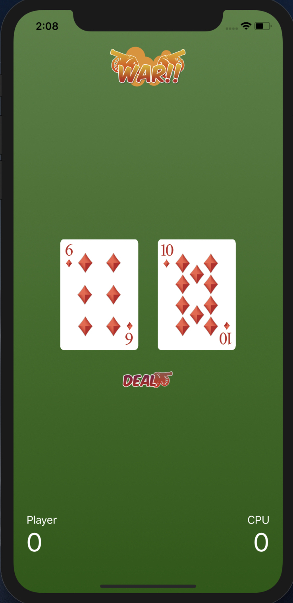
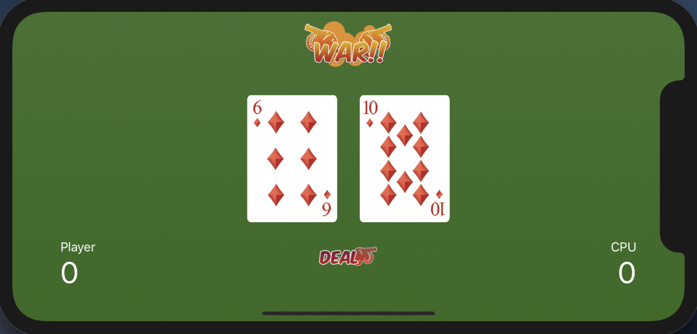
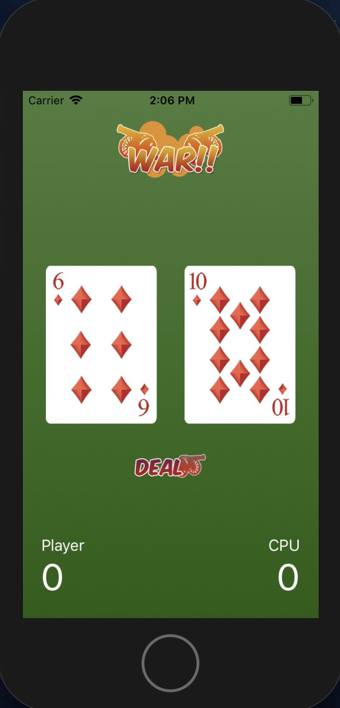
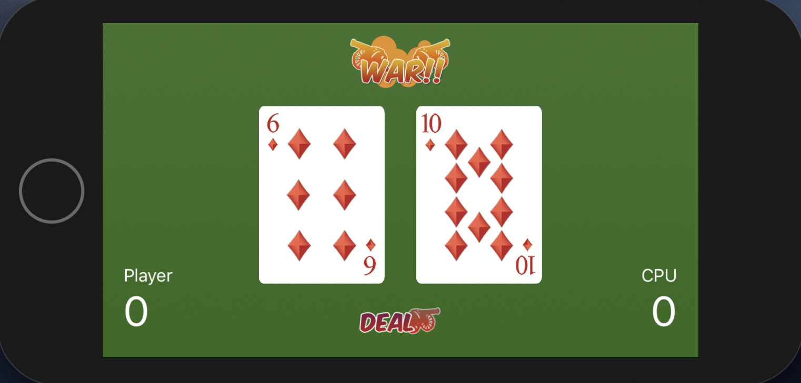

<h1>About this repository</h1>

I created this repository to learn a new Auto Layout technique that’ll let you specify a constraint for a specific category of screens known as a size classes. Below you will be able to see how I have added variation of constraints to the logo and stack view of the cards and deal button in order to better display on a size class of compact width and compact height such as the iPhone SE. This creates a better user experience for multiple screen sizes and both portrait and landscape orientation.

<h3>iPhone XR (wC hR)</h3>
 

<h3>iPhone SE (wC hC)</h3>
 
